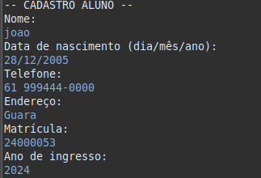

# :bookmark_tabs: Sistema Acadêmico - FCTE

## :bookmark: Descrição do Projeto

Desenvolvimento de um sistema acadêmico para gerenciar alunos, disciplinas, professores, turmas, avaliações e frequência, utilizando os conceitos de orientação a objetos (herança, polimorfismo e encapsulamento) e persistência de dados em arquivos.

O enunciado do trabalho pode ser encontrado aqui:
- [Trabalho 1 - Sistema Acadêmico](https://github.com/lboaventura25/OO-T06_2025.1_UnB_FCTE/blob/main/trabalhos/ep1/README.md)

## :clipboard: Dados do Aluno

- **Nome completo:** João Paulo de Sousa Lima
- **Matrícula:** 242005338
- **Curso:** Orientação a Objetos - 2025/1
- **Turma:** 06

---

## :books: Instruções para Compilação e Execução

1. **Compilação:**  
   [javac Main.java]

2. **Execução:**  
   [java Main]

3. :open_file_folder: **Estrutura de Pastas:**  
   
Foi a seguinte:

      -Main  
         -Pessoa
            -Professor
               -ProfGerencia
            -Aluno
               -AlunoGerencia
      -Materia
         -MateriaGerencia
      -Nota
      -Turma
          -TurmaGerencia
      -Output (Dados em CSV)

3. **Versão do JAVA utilizada:**  
   Java 21

---

## :video_camera: Vídeo de Demonstração

-

https://github.com/user-attachments/assets/c344b6c2-b9d7-48a5-9bd9-e19263b4e0ff

---

## :floppy_disk: Prints da Execução

1. Menu Principal:  
   

2. Cadastro de Aluno:  
   

3. Relatório de Frequência/Notas:  
   

---

## :scroll: Principais Funcionalidades Implementadas

- [X] Cadastro, listagem, matrícula e trancamento de alunos (Normais e Especiais)
- [X] Cadastro de disciplinas e criação de turmas (presenciais e remotas)
- [X] Matrícula de alunos em turmas, respeitando vagas e pré-requisitos
- [X] Lançamento de notas e controle de presença
- [ ] Cálculo de média final e verificação de aprovação/reprovação
- [X] Relatórios de desempenho acadêmico por aluno, turma e disciplina
- [X] Persistência de dados em arquivos (.txt ou .csv)
- [ ] Tratamento de duplicidade de matrículas
- [X] Uso de herança, polimorfismo e encapsulamento

---

## :pushpin: Observações (Extras ou Dificuldades)

- A maior dificuldade foi implementar e salvar os dados em CSV. Além da tentativa de criação de um banco de dados utilizando o MySQL e a criação de uma interface gráfica utilizando o JavaSwing/Jframe, que foram deixados de lado da parte final do projeto devido a complexidade da implementação de ambos no código final;
- Integração no Código do cálculo da Média Final, que não consegui terminar a tempo;
- Utilização do CSV com a utilização apenas da biblioteca Java 21, sem a utlização do repositório Maven.

---

## :email: Contato

- joaopaulosousalima975@gmail.com
